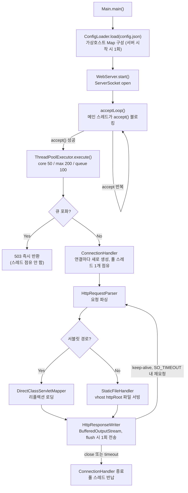

# was-lab

JDK 소켓 레벨부터 직접 구현한 Java Web Application Server. Servlet 유사 API, 가상호스트, 정적 파일 서빙, 스레드풀, graceful shutdown을 포함한다.

## 배경

Spring과 같은 프레임워크가 내부적으로 처리해주던 요청 파싱, 커넥션 관리, 스레드 모델, 정적/동적 리소스 디스패치, 리소스 한계 처리 등을 ServerSocket 레벨부터 직접 구현하며 WAS(Web Application Server)의 동작 원리를 이해하고자 진행한 프로젝트입니다. 단순히 기능을 구현하는 것을 넘어, 구현 과정에서 마주한 문제와 그것을 해결한 이유를 기록하는 데 중점을 두었습니다.

## 모듈 구성

| 모듈 | 역할 |
|------|------|
| `was-core` | 서버 본체. 소켓 accept, HTTP 파싱, 라우팅, 정적파일/서블릿 디스패치, 설정 로딩, 보안 규칙, 로깅 |
| `was-servlets` | 서블릿 구현체(`Hello`, `CurrentTime` 등). `was-core`와 같은 JAR로 묶여 클래스패스에서 로딩됨 |
| `webapp` | 가상호스트별 정적 콘텐츠 루트(`a/`, `b/`)와 403/404/500 에러 페이지 |

## 아키텍처

### 요청 처리 흐름



스레드는 `ThreadPoolExecutor`로 재사용하지만, 연결 단위 처리 객체(`ConnectionHandler`)는 매 연결마다 새로 만든다. 즉 스레드 자체는 풀링되어 있어도 커넥션 하나가 스레드 하나를 끝까지 붙잡는 thread-per-connection 모델이라, 동시 커넥션 수가 `maxSize`(200)를 넘고 큐(100)까지 차면 그 이후 요청은 스레드를 잡지도 못하고 바로 503이 나간다.

### 설정 (`config.json`)

```json
{
  "port": 8080,
  "keepAliveTimeoutSeconds": 20,
  "shutdownTimeoutSeconds": 30,
  "blockedExtensions": [".exe"],
  "threadPool": { "coreSize": 50, "maxSize": 200, "keepAliveSeconds": 60, "queueSize": 100 },
  "virtualHosts": [
    { "host": "a.com", "httpRoot": "./webapp/a", "errorPages": { "403": "403.html", "404": "404.html", "500": "500.html" } }
  ]
}
```

- Host 헤더로 가상호스트를 매칭하고, 매칭 실패 시 설정 파일에 등록된 첫 번째 가상호스트로 폴백한다.
- `blockedExtensions`에 등록된 확장자로 오는 요청은 403.
- `httpRoot` 상위 디렉터리로 나가는 경로(path traversal)는 차단한다.

## 기능별 구현 내용

**가상호스트 매칭**: Host 헤더 문자열을 키로 하는 `Map`에서 조회한다(O(1)). 매칭되는 호스트가 없으면 설정 파일에 나열된 순서상 첫 번째 가상호스트로 폴백하는데, 이 순서 보장을 위해 내부적으로 `LinkedHashMap`을 쓴다.

**에러 페이지 처리**: 403/404/500 각각의 상황에서 vhost 설정에 지정된 HTML 파일을 읽어 응답 바디로 내려준다. vhost별로 다른 에러 페이지를 지정할 수 있다.

**보안 규칙**: 확장자 차단은 파일명에서 확장자만 잘라내 `Set.contains()`로 조회한다. path traversal 차단은 요청 경로를 정규화한 뒤 `httpRoot` 기준 상위 경로로 벗어나는지 검사해서 막는다. 새 규칙을 추가하려면 인터페이스 하나만 구현하면 되도록 열어뒀다.

**로깅**: logback `SizeAndTimeBasedRollingPolicy`로 일별 폴더(`logs/yyyy-MM-dd/`)에 로그를 분리하고, 파일당 10MB 초과 시 분할, 30일치 보관, 총 용량 1GB로 제한한다. 접근 로그는 HTTP 상태 코드에 따라 로그 레벨을 다르게 남긴다(5xx는 ERROR, 4xx는 WARN, 그 외는 INFO). 에러 발생 시에는 스택트레이스 전체를 남긴다.

**서블릿 API**: `SimpleServlet` 추상 클래스가 `service`, `getParameter`, `getWriter`를 제공한다. `DirectClassServletMapper`가 요청 경로(`/ClassName`)를 그대로 클래스명으로 써서 `Class.forName()`으로 리플렉션 로딩한다. `CurrentTime` 서블릿이 실제 구현 예시.

**Keep-Alive**: 소켓의 `SO_TIMEOUT`을 `keepAliveTimeoutSeconds`로 설정해서, 이 시간 동안 다음 요청이 안 들어오면 `SocketTimeoutException`을 유도해 커넥션을 정리한다. 별도 타이머 스레드 없이 소켓 자체 타임아웃으로 유휴 커넥션을 회수하는 방식.

**정적 파일 서빙 + ETag**: 처음에는 `Files.readAllBytes()`로 파일 전체를 읽어서 응답했는데, 이러면 큰 파일 여러 개가 동시에 요청될 때 힙이 위험해진다. `Content-Length`는 `Files.size()`로 미리 구하고, 바디는 `Files.newInputStream()` + `InputStream.transferTo()`로 8KB 버퍼 단위 스트리밍하도록 바꿨다. 힙 사용량이 파일 크기와 무관하게 일정해짐. ETag는 파일 내용 해시로 만들어서, 요청의 `If-None-Match`가 일치하면 바디 없이 304만 내려준다.

**ThreadPoolExecutor 설정화**: `coreSize`/`maxSize`/`queueSize`를 설정 파일로 뺐다. 큐까지 가득 찬 상태에서 새 연결이 들어오면 스레드를 잡지 않고 바로 503을 내려서, 서버가 무한정 커넥션을 받다가 죽는 상황을 막는다.

**Graceful shutdown**: 종료 신호가 오면 (1) 신규 연결은 즉시 503으로 거절하고, (2) 이미 처리 중인 요청들은 `shutdownTimeoutSeconds` 동안 마무리할 시간을 준 뒤, (3) 그래도 안 끝나면 강제 종료한다.

## 트러블슈팅

만들면서 발견하고 고친 것들을 문제 → 원인 → 해결 순으로 정리했다.

**1. `NoClassDefFoundError`가 안 잡혀서 서버가 불안정해질 수 있었던 문제**
`DirectClassServletMapper`가 서블릿 클래스를 리플렉션으로 로딩할 때 `ReflectiveOperationException`만 캐치하고 있었다. 문제는, 컴파일 시점엔 있었는데 런타임 classpath에서 의존 클래스가 빠진 경우 발생하는 `NoClassDefFoundError`는 `Exception`이 아니라 `Error` 계열이라 그대로 전파돼버린다는 것. 멀티캐치로 `NoClassDefFoundError`도 같이 잡아서 `RuntimeException`으로 감싸고 `Optional.empty()`로 처리되게 고쳤다.

**2. 정적 파일 서빙이 파일 전체를 메모리에 올리고 있던 문제**
위 "정적 파일 서빙 + ETag" 항목 참고. `Files.readAllBytes()` → 스트리밍 방식으로 교체.

**3. 헤더/바디를 나눠 쓰면서 시스템콜을 두 번 내던 문제**
소켓 출력 스트림에 헤더 `write()`, 바디 `write()`를 따로 호출하고 있었다. 버퍼링 없이 바로 나가면 패킷/시스템콜이 두 번 발생한다(Nagle 알고리즘이 합쳐줄 수도 있지만 보장된 동작은 아님). 소켓 출력 스트림을 `BufferedOutputStream`으로 감싸서 `flush()` 시점에 한 번에 나가도록 바꿨다.

**4. 개발 환경(Windows)에서만 우연히 통과하던 클래스 로딩**
`DirectClassServletMapper`는 URL 경로를 그대로 클래스명으로 써서 `Class.forName()`을 호출한다. Java 클래스명은 대소문자를 구분해야 하는데, Windows(NTFS)나 macOS 기본 파일시스템은 대소문자를 구분하지 않다보니 `/hello` 요청이 실제 클래스 `Hello`와 그냥 매칭돼버렸다. 개발 환경에서는 문제없이 동작하다가 Linux(대소문자 구분 파일시스템)에 배포하면 `ClassNotFoundException`이 날 수 있는, 코드가 아니라 환경 차이에서 오는 이슈였다. 코드로 고칠 부분은 아니고, 배포 전에 반드시 Linux 환경에서 실제 요청 경로로 검증해봐야 한다는 걸 확인한 정도.

## 알려진 제한사항

- **FD 한도 정책 부재**: `accept()`가 실패하면 로그만 남기고 재시도한다. 기본 설정(스레드풀 max 200 + 큐 100)은 OS 기본 ulimit(1024) 안에서는 안전하지만, 설정값을 크게 올리면 `ulimit -n`도 같이 올려야 한다.
- **Thread-per-connection 모델**: 커넥션마다 스레드를 하나씩 점유한다(NIO/이벤트 루프는 안 씀). 소규모 트래픽에는 충분하지만 대규모 동시접속에는 스레드 자원 소모가 크다. 실무에서 이런 걸 직접 구현하는 대신 Netty 같은 프레임워크를 쓰는 이유이기도 하다.

## 서블릿 추가하기

`was-servlets` 모듈에 `SimpleServlet`을 구현한 클래스를 추가하면, `DirectClassServletMapper`가 요청 경로(`/ClassName`)를 클래스명으로 그대로 매핑해서 리플렉션으로 로딩한다. URL prefix 같은 매핑 방식이 더 필요하면 `ServletMapper` 인터페이스를 새로 구현하면 된다.

## 실행

```bash
mvn clean package
java -jar was.jar
```

`was-servlets`의 `maven-shade-plugin`이 Jackson, logback 등 의존성까지 다 묶은 fat jar(`was.jar`)를 빌드하고, `maven-antrun-plugin`이 이걸 프로젝트 루트로 복사한다. `Main`이 실행 위치 기준으로 `./config.json`을 읽기 때문에 **프로젝트 루트에서** 실행해야 한다.

## 테스트

```bash
mvn test
```

`was-core`, `was-servlets` 각 모듈에 JUnit4 기반 단위 테스트가 있다.