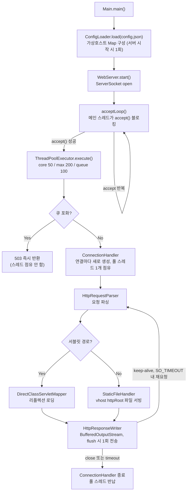

# was-lab

HTTP/1.1 스펙 기반으로 `ServerSocket`부터 직접 구현한 경량 Java WAS(Web Application Server)

## 소개

HTTP/1.1의 동작 흐름(요청 파싱, keep-alive 기반 커넥션 재사용, 응답 생성)을 학습하기 위해 만든 프로젝트입니다. Spring과 Tomcat이 내부적으로 처리해주던 요청 파싱, 커넥션·스레드 관리, 서블릿 로딩, 정적/동적 리소스 디스패치, 리소스 한계 처리를 직접 구현하며 WAS의 동작 원리를 이해하는 데 목적을 두었습니다.

## 주요 기능

| 영역 | 내용 |
|---|---|
| HTTP/1.1 | GET / HEAD / POST, keep-alive |
| 가상호스트 | Host 헤더 기반 매칭, 미매칭 시 첫 번째 호스트로 폴백 |
| 정적 파일 | 스트리밍 전송, ETag 기반 304 응답 |
| 서블릿 | `SimpleServlet` 기반 Servlet 유사 API, 리플렉션 로딩 |
| 안정성 | 스레드풀 포화 시 503, 유휴 연결 자동 회수, graceful shutdown |
| 보안 | 확장자 차단, path traversal 차단 |
| 로깅 | 일별 폴더 분리, 상태 코드별 로그 레벨 |

### 연결 재사용과 과부하 대응

Keep-Alive로 하나의 연결에서 여러 요청을 처리해 연결 수립 비용을 줄였습니다. 또한 스레드 운영 정책(풀 크기 제한, 초과 요청 503 거절, 유휴 연결 회수)을 적용해, 과부하 상황에서도 서버가 멈추지 않고 이미 수락한 요청을 안정적으로 처리하도록 설계했습니다.

## 실행

```bash
mvn clean package
java -jar was.jar
```

- `was-servlets`의 `maven-shade-plugin`이 Jackson, logback 등 의존성까지 묶은 fat jar(`was.jar`)를 빌드하고, `maven-antrun-plugin`이 이를 프로젝트 루트로 복사합니다.
- `Main`이 실행 위치 기준으로 `./config.json`을 읽으므로 **반드시 프로젝트 루트에서 실행**해야 합니다.

테스트는 `was-core`, `was-servlets` 각 모듈의 JUnit4 단위 테스트로 실행합니다.

```bash
mvn test
```

## 모듈 구성

| 모듈 | 역할 |
|---|---|
| `was-core` | 서버 본체. 소켓 accept, HTTP 파싱, 라우팅, 정적파일/서블릿 디스패치, 설정 로딩, 보안 규칙, 로깅 |
| `was-servlets` | 서블릿 구현체(`Hello`, `CurrentTime` 등). `was-core`와 같은 JAR로 묶여 클래스패스에서 로딩됨 |
| `webapp` | 가상호스트별 정적 콘텐츠 루트(`a/`, `b/`)와 403/404/500 에러 페이지 |

## 아키텍처

### 요청 처리 흐름


```mermaid
flowchart TD
    A["Main.main()"] --> B["ConfigLoader.load(config.json)<br/>가상호스트 Map 구성 (서버 시작 시 1회)"]
    B --> C["WebServer.start()<br/>ServerSocket open"]
    C --> D["acceptLoop()<br/>메인 스레드가 accept() 블로킹"]
    D -->|"accept() 성공"| E["ThreadPoolExecutor.execute()<br/>core 50 / max 200 / queue 100"]
    E --> E1{"큐 포화?"}
    E1 -->|Yes| E2["503 즉시 반환<br/>(스레드 점유 안 함)"]
    E1 -->|No| F2["ConnectionHandler<br/>연결마다 새로 생성, 풀 스레드 1개 점유"]
    F2 --> F["HttpRequestParser<br/>요청 파싱"]
    F --> G{"서블릿 경로?"}
    G -->|Yes| H["DirectClassServletMapper<br/>리플렉션 로딩"]
    G -->|No| I["StaticFileHandler<br/>vhost httpRoot 파일 서빙"]
    H --> J["HttpResponseWriter<br/>BufferedOutputStream, flush 시 1회 전송"]
    I --> J
    J -->|"keep-alive, SO_TIMEOUT 내 재요청"| F
    J -->|"close 또는 timeout"| K["ConnectionHandler 종료<br/>풀 스레드 반납"]
    D -->|accept 반복| D
```

### 스레드 모델

스레드는 `ThreadPoolExecutor`로 재사용하지만, 커넥션 하나가 스레드 하나를 끝까지 점유하는 **thread-per-connection** 모델입니다.

1. 서버 시작 시 미리 만들어 둔 core 스레드(50)가 먼저 커넥션을 받고, 모두 사용 중이면 큐(100)에 쌓입니다.
2. 큐까지 차면 스레드가 core(50)를 넘어 max(200)까지 늘어납니다.
3. max까지 쓰고 큐도 다시 꽉 차면, 이후 요청은 스레드도 큐도 잡지 못하고 즉시 503으로 거절됩니다.

## 설정

`config.json`

```json
{
  "port": 8080,
  "keepAliveTimeoutSeconds": 20,
  "shutdownTimeoutSeconds": 30,
  "blockedExtensions": [".exe"],
  "threadPool": { "coreSize": 50, "maxSize": 200, "keepAliveSeconds": 60, "queueSize": 100 },
  "virtualHosts": [
    { "host": "a.com", "httpRoot": "./webapp/a", "errorPages": { "403": "403.html", "404": "404.html", "500": "500.html" } }
  ]
}
```

- Host 헤더로 가상호스트를 매칭하고, 매칭에 실패하면 설정 파일에 등록된 첫 번째 가상호스트로 폴백합니다.
- `blockedExtensions`에 등록된 확장자 요청은 403으로 응답합니다.
- `httpRoot` 상위 디렉터리로 나가는 경로(path traversal)는 차단합니다.

## 구현 상세

### 가상호스트 매칭
Host 헤더 문자열을 키로 `Map`에서 조회합니다(O(1)). 매칭되는 호스트가 없으면 설정 파일 순서상 첫 번째 가상호스트로 폴백하며, 이 순서를 보장하기 위해 내부적으로 `LinkedHashMap`을 사용합니다.

### 에러 페이지
403/404/500 상황에서 vhost 설정에 지정된 HTML 파일을 읽어 응답 바디로 내려줍니다. vhost별로 다른 에러 페이지를 지정할 수 있습니다.

### 보안 규칙
- **확장자 차단**: 파일명에서 확장자만 잘라 `Set.contains()`로 조회합니다.
- **path traversal 차단**: 요청 경로를 정규화한 뒤 `httpRoot` 상위로 벗어나는지 검사합니다.
- 새 규칙은 인터페이스 하나만 구현하면 추가할 수 있도록 열어두었습니다.

### 로깅
- logback `SizeAndTimeBasedRollingPolicy`로 일별 폴더(`logs/yyyy-MM-dd/`)에 분리하고, 파일당 10MB 초과 시 분할하며, 30일 보관, 총 용량 1GB로 제한합니다.
- 접근 로그는 상태 코드별로 레벨을 구분합니다. 5xx는 ERROR, 4xx는 WARN, 그 외는 INFO입니다.
- 에러 발생 시 스택트레이스 전체를 기록합니다.

### 서블릿 API
`SimpleServlet` 인터페이스가 `init` → `service` → `destroy` 생명주기를 정의합니다(`init`/`destroy`는 default 메서드라 필요할 때만 구현). `service`로 넘어오는 `ServletRequest`에서 `getParameter()`, `getHeader()`, `getBody()`로 요청을 읽고, `ServletResponse.getWriter()`로 응답 바디를 씁니다. `DirectClassServletMapper`가 요청 경로(`/ClassName`)를 그대로 클래스명으로 사용해 `Class.forName()`으로 리플렉션 로딩합니다. 구현 예시는 `CurrentTime` 서블릿을 참고해 주세요.

### Keep-Alive
소켓의 `SO_TIMEOUT`을 `keepAliveTimeoutSeconds`로 설정해, 이 시간 안에 다음 요청이 없으면 `SocketTimeoutException`으로 커넥션을 정리합니다. 별도 타이머 스레드 없이 소켓 자체 타임아웃으로 유휴 커넥션을 회수합니다.

### 정적 파일 서빙과 ETag
`Content-Length`는 `Files.size()`로 미리 구하고, 바디는 `Files.newInputStream()` + `InputStream.transferTo()`로 8KB 버퍼 단위 스트리밍합니다. 힙 사용량이 파일 크기와 무관하게 일정합니다. ETag는 파일의 최종 수정 시각과 크기를 조합해(`"<lastModified hex>-<size hex>"`) 만들며, 요청의 `If-None-Match`가 일치하면 바디 없이 304만 응답합니다. 

### 스레드풀 설정화
`coreSize` / `maxSize` / `queueSize`를 설정 파일로 분리했습니다. 큐까지 가득 찬 상태에서 새 연결이 오면 스레드를 잡지 않고 바로 503을 내려, 무한정 연결을 받다가 서버가 죽는 상황을 막습니다.

### Graceful shutdown
1. 종료 신호가 오면 신규 연결은 즉시 503으로 거절합니다.
2. 처리 중인 요청에는 `shutdownTimeoutSeconds` 동안 마무리할 시간을 줍니다.
3. 그래도 끝나지 않으면 강제 종료합니다.

## 알려진 제한사항

- **FD 한도 정책 부재**: `accept()`가 실패하면 로그만 남기고 재시도합니다. 기본 설정(스레드풀 max 200 + 큐 100)은 OS 기본 ulimit(1024) 안에서 안전하지만, 설정값을 크게 올리면 `ulimit -n`도 함께 올려야 합니다.
- **Thread-per-connection 모델**: 커넥션마다 스레드를 점유합니다(NIO/이벤트 루프 미사용). 소규모 트래픽에는 충분하지만 대규모 동시 접속에서는 스레드 자원 소모가 크며, 실무에서 Netty 같은 프레임워크를 쓰는 이유이기도 합니다.

## 서블릿 추가하기

`was-servlets` 모듈에 `SimpleServlet`을 구현한 클래스를 추가하면, `DirectClassServletMapper`가 요청 경로(`/ClassName`)를 클래스명으로 매핑해 리플렉션으로 로딩합니다. URL prefix 같은 다른 매핑 방식이 필요하면 `ServletMapper` 인터페이스를 새로 구현하면 됩니다.
