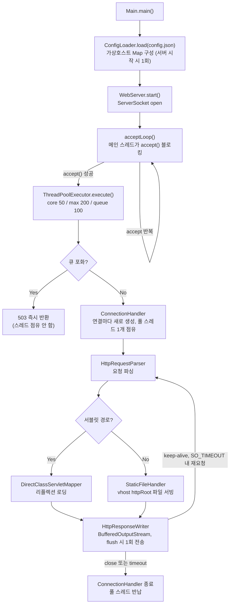

# was-lab

JDK 소켓 레벨부터 직접 구현한 Java Web Application Server. Servlet 유사 API, 가상호스트, 정적 파일 서빙, 스레드풀, graceful shutdown을 포함한다.

## 배경

Spring과 같은 프레임워크가 내부적으로 처리해주던 요청 파싱, 커넥션 관리, 스레드 모델, 정적/동적 리소스 디스패치, 리소스 한계 처리 등을 ServerSocket 레벨부터 직접 구현하며 WAS(Web Application Server)의 동작 원리를 이해하고자 진행한 프로젝트입니다. 단순히 기능을 구현하는 것을 넘어, 구현 과정에서 마주한 문제와 그것을 해결한 이유를 기록하는 데 중점을 두었습니다.

## 모듈 구성

| 모듈 | 역할 |
|------|------|
| `was-core` | 서버 본체. 소켓 accept, HTTP 파싱, 라우팅, 정적파일/서블릿 디스패치, 설정 로딩, 보안 규칙, 로깅 |
| `was-servlets` | 서블릿 구현체(`Hello`, `CurrentTime` 등). `was-core`와 같은 JAR로 묶여 클래스패스에서 로딩됨 |
| `webapp` | 가상호스트별 정적 콘텐츠 루트(`a/`, `b/`)와 403/404/500 에러 페이지 |

## 아키텍처

### 요청 처리 흐름


```mermaid
flowchart TD
    A["Main.main()"] --> B["ConfigLoader.load(config.json)<br/>가상호스트 Map 구성 (서버 시작 시 1회)"]
    B --> C["WebServer.start()<br/>ServerSocket open"]
    C --> D["acceptLoop()<br/>메인 스레드가 accept() 블로킹"]
    D -->|"accept() 성공"| E["ThreadPoolExecutor.execute()<br/>core 50 / max 200 / queue 100"]
    E --> E1{"큐 포화?"}
    E1 -->|Yes| E2["503 즉시 반환<br/>(스레드 점유 안 함)"]
    E1 -->|No| F2["ConnectionHandler<br/>연결마다 새로 생성, 풀 스레드 1개 점유"]
    F2 --> F["HttpRequestParser<br/>요청 파싱"]
    F --> G{"서블릿 경로?"}
    G -->|Yes| H["DirectClassServletMapper<br/>리플렉션 로딩"]
    G -->|No| I["StaticFileHandler<br/>vhost httpRoot 파일 서빙"]
    H --> J["HttpResponseWriter<br/>BufferedOutputStream, flush 시 1회 전송"]
    I --> J
    J -->|"keep-alive, SO_TIMEOUT 내 재요청"| F
    J -->|"close 또는 timeout"| K["ConnectionHandler 종료<br/>풀 스레드 반납"]
    D -->|accept 반복| D
```

스레드는 `ThreadPoolExecutor`로 재사용하지만, 연결 단위 처리 객체(`ConnectionHandler`)는 매 연결마다 새로 만든다. 즉 스레드 자체는 풀링되어 있어도 커넥션 하나가 스레드 하나를 끝까지 붙잡는 thread-per-connection 모델이다. 동시 커넥션이 늘면 먼저 큐(100)가 차오르고, 그래도 못 따라가면 스레드가 core(50)를 넘어 max(200)까지 늘어난다. max까지 다 쓰고 큐도 다시 꽉 차면, 그 이후 요청은 스레드도 큐도 못 잡고 바로 503이 나간다.

### 설정 (`config.json`)

```json
{
  "port": 8080,
  "keepAliveTimeoutSeconds": 20,
  "shutdownTimeoutSeconds": 30,
  "blockedExtensions": [".exe"],
  "threadPool": { "coreSize": 50, "maxSize": 200, "keepAliveSeconds": 60, "queueSize": 100 },
  "virtualHosts": [
    { "host": "a.com", "httpRoot": "./webapp/a", "errorPages": { "403": "403.html", "404": "404.html", "500": "500.html" } }
  ]
}
```

- Host 헤더로 가상호스트를 매칭하고, 매칭 실패 시 설정 파일에 등록된 첫 번째 가상호스트로 폴백한다.
- `blockedExtensions`에 등록된 확장자로 오는 요청은 403.
- `httpRoot` 상위 디렉터리로 나가는 경로(path traversal)는 차단한다.

## 기능별 구현 내용

**가상호스트 매칭**: Host 헤더 문자열을 키로 하는 `Map`에서 조회한다(O(1)). 매칭되는 호스트가 없으면 설정 파일에 나열된 순서상 첫 번째 가상호스트로 폴백하는데, 이 순서 보장을 위해 내부적으로 `LinkedHashMap`을 쓴다.

**에러 페이지 처리**: 403/404/500 각각의 상황에서 vhost 설정에 지정된 HTML 파일을 읽어 응답 바디로 내려준다. vhost별로 다른 에러 페이지를 지정할 수 있다.

**보안 규칙**: 확장자 차단은 파일명에서 확장자만 잘라내 `Set.contains()`로 조회한다. path traversal 차단은 요청 경로를 정규화한 뒤 `httpRoot` 기준 상위 경로로 벗어나는지 검사해서 막는다. 새 규칙을 추가하려면 인터페이스 하나만 구현하면 되도록 열어뒀다.

**로깅**: logback `SizeAndTimeBasedRollingPolicy`로 일별 폴더(`logs/yyyy-MM-dd/`)에 로그를 분리하고, 파일당 10MB 초과 시 분할, 30일치 보관, 총 용량 1GB로 제한한다. 접근 로그는 HTTP 상태 코드에 따라 로그 레벨을 다르게 남긴다(5xx는 ERROR, 4xx는 WARN, 그 외는 INFO). 에러 발생 시에는 스택트레이스 전체를 남긴다.

**서블릿 API**: `SimpleServlet` 인터페이스가 `init` → `service` → `destroy` 생명주기를 정의한다(`init`/`destroy`는 default 메서드라 필요할 때만 구현). `service`로 넘어오는 `ServletRequest.getParameter()`로 쿼리 파라미터를 읽고, `ServletResponse.getWriter()`로 응답 바디를 쓴다. `DirectClassServletMapper`가 요청 경로(`/ClassName`)를 그대로 클래스명으로 써서 `Class.forName()`으로 리플렉션 로딩한다. `CurrentTime` 서블릿이 실제 구현 예시.

- **생명주기**: `init()`은 해당 서블릿으로 첫 요청이 들어올 때 1회(지연 초기화), `service()`는 요청마다, `destroy()`는 graceful shutdown 시 생성에 성공한 서블릿에 대해 1회 호출된다.
- **싱글톤**: 클래스당 인스턴스 하나를 `ConcurrentHashMap`에 캐시해 재사용한다. `computeIfAbsent`로 동시 첫 요청에서도 생성/`init()`은 한 번만 일어난다. 여러 워커 스레드가 같은 인스턴스의 `service()`를 동시에 호출하므로, 서블릿에 상태 필드를 두면 동기화는 서블릿 구현 측 책임이다.
- **로딩 순서**: 로딩(`initialize=false`) → `SimpleServlet` 타입 체크 → (서블릿일 때만) 인스턴스 생성 시 클래스 초기화 → `init()`. 서블릿이 아닌 경로는 크기 제한이 있는 실패 캐시에 기록해 다음 요청부터 클래스 탐색을 건너뛴다(트러블슈팅 5, 6번 참고).

**Keep-Alive**: 소켓의 `SO_TIMEOUT`을 `keepAliveTimeoutSeconds`로 설정해서, 이 시간 동안 다음 요청이 안 들어오면 `SocketTimeoutException`을 유도해 커넥션을 정리한다. 별도 타이머 스레드 없이 소켓 자체 타임아웃으로 유휴 커넥션을 회수하는 방식.

**정적 파일 서빙 + ETag**: 처음에는 `Files.readAllBytes()`로 파일 전체를 읽어서 응답했는데, 이러면 큰 파일 여러 개가 동시에 요청될 때 힙이 위험해진다. `Content-Length`는 `Files.size()`로 미리 구하고, 바디는 `Files.newInputStream()` + `InputStream.transferTo()`로 8KB 버퍼 단위 스트리밍하도록 바꿨다. 힙 사용량이 파일 크기와 무관하게 일정해짐. ETag는 파일의 최종 수정 시각과 크기를 조합해(`"<lastModified hex>-<size hex>"`) 만들고, 요청의 `If-None-Match`가 일치하면 바디 없이 304만 내려준다. 내용 해시를 쓰면 ETag를 계산하려고 매 요청마다 파일 전체를 읽어야 해서 스트리밍으로 얻은 이점이 사라지기 때문에, 파일 메타데이터만으로 만드는 방식을 택했다(nginx와 같은 방식).

**ThreadPoolExecutor 설정화**: `coreSize`/`maxSize`/`queueSize`를 설정 파일로 뺐다. 큐까지 가득 찬 상태에서 새 연결이 들어오면 스레드를 잡지 않고 바로 503을 내려서, 서버가 무한정 커넥션을 받다가 죽는 상황을 막는다.

**Graceful shutdown**: 종료 신호가 오면 (1) 신규 연결은 즉시 503으로 거절하고, (2) 이미 처리 중인 요청들은 `shutdownTimeoutSeconds` 동안 마무리할 시간을 준 뒤, (3) 그래도 안 끝나면 강제 종료한다.

## 트러블슈팅

만들면서 발견하고 고친 것들을 문제 → 원인 → 해결 순으로 정리했다.

**1. `NoClassDefFoundError`가 안 잡혀서 서버가 불안정해질 수 있었던 문제**
`DirectClassServletMapper`가 서블릿 클래스를 리플렉션으로 로딩할 때 `ReflectiveOperationException`만 캐치하고 있었다. 문제는, 컴파일 시점엔 있었는데 런타임 classpath에서 의존 클래스가 빠진 경우 발생하는 `NoClassDefFoundError`는 `Exception`이 아니라 `Error` 계열이라 그대로 전파돼버린다는 것. 멀티캐치로 `NoClassDefFoundError`도 같이 잡아서 `RuntimeException`으로 감싸고 `Optional.empty()`로 처리되게 고쳤다. 이후 같은 계열인 `ExceptionInInitializerError`도 빠져나간다는 걸 발견해 공통 부모인 `LinkageError`로 범위를 넓혔다(5번 참고).

**2. 정적 파일 서빙이 파일 전체를 메모리에 올리고 있던 문제**
위 "정적 파일 서빙 + ETag" 항목 참고. `Files.readAllBytes()` → 스트리밍 방식으로 교체.

**3. 헤더/바디를 나눠 쓰면서 시스템콜을 두 번 내던 문제**
소켓 출력 스트림에 헤더 `write()`, 바디 `write()`를 따로 호출하고 있었다. 버퍼링 없이 바로 나가면 패킷/시스템콜이 두 번 발생한다(Nagle 알고리즘이 합쳐줄 수도 있지만 보장된 동작은 아님). 소켓 출력 스트림을 `BufferedOutputStream`으로 감싸서 `flush()` 시점에 한 번에 나가도록 바꿨다.

**4. 개발 환경(Windows)에서만 우연히 통과하던 클래스 로딩**
`DirectClassServletMapper`는 URL 경로를 그대로 클래스명으로 써서 `Class.forName()`을 호출한다. Java 클래스명은 대소문자를 구분해야 하는데, Windows(NTFS)나 macOS 기본 파일시스템은 대소문자를 구분하지 않다보니 `/hello` 요청이 실제 클래스 `Hello`와 그냥 매칭돼버렸다. 개발 환경에서는 문제없이 동작하다가 Linux(대소문자 구분 파일시스템)에 배포하면 `ClassNotFoundException`이 날 수 있는, 코드가 아니라 환경 차이에서 오는 이슈였다. 코드로 고칠 부분은 아니고, 배포 전에 반드시 Linux 환경에서 실제 요청 경로로 검증해봐야 한다는 걸 확인한 정도.

**5. URL로 지정한 임의 클래스의 static 초기화가 타입 체크 전에 실행되던 문제**
- 문제: `Class.forName(className)`은 `Class.forName(className, true, loader)`와 같아서, 로딩과 동시에 클래스 초기화(`static {}` 블록, static 필드 초기화)까지 실행한다. 그런데 `className`은 URL에서 온 외부 입력이고, `SimpleServlet` 타입 체크는 그 다음에 하고 있었다. 즉 클래스패스에 있는 아무 클래스(JDK, Jackson, logback 등)나 URL로 지정해 static 코드를 실행시킬 수 있었다.
- 추가로 발견한 것: static 초기화 중 예외가 나면 `ExceptionInInitializerError`가 발생하는데, `Error` 계열이라 기존 catch(`ReflectiveOperationException | NoClassDefFoundError`)를 빠져나가 워커 스레드가 응답 없이 죽었다.
- 원인: 클래스 로딩의 세 단계(로딩 → 링킹 → 초기화) 중 코드가 실행되는 건 초기화뿐인데, 검증 전에 초기화까지 한 번에 하고 있었다.
- 해결: `Class.forName(className, false, loader)`로 로딩만 하고, 타입 체크를 통과한 서블릿만 `newInstance()` 시점에 초기화되도록 순서를 바꿨다. 서블릿이 아닌 클래스는 초기화될 일이 없어진다. catch 범위는 `NoClassDefFoundError` → `LinkageError`로 넓혔다. JVM 자체 이상인 `VirtualMachineError`(OOM 등)는 복구 불가능하므로 일부러 잡지 않는다.

**6. 정적 파일 요청마다 클래스패스 탐색 + 예외 생성 비용이 들던 문제**
- 문제: 디스패처는 서블릿 매핑을 먼저 시도하므로 `/index.html`, `/favicon.ico` 같은 정적 요청도 매번 `Class.forName("index.html")`을 거쳤다. 실패 결과는 캐시되지 않아서 요청마다 클래스패스(JAR)를 탐색하고 스택트레이스가 담긴 `ClassNotFoundException`을 새로 만들었다.
- 해결: 서블릿이 아닌 경로(클래스 없음, `SimpleServlet` 미구현)를 실패 캐시에 기록해 다음 요청부터 바로 건너뛰게 했다.
- 고려한 점:
  - **크기 제한**: 제한 없는 캐시는 랜덤 경로를 계속 보내는 요청으로 메모리가 무한히 늘어나는 DoS 지점이 된다. `LinkedHashMap.removeEldestEntry`를 오버라이드해 1000개를 넘으면 가장 오래된 항목부터 버리는 FIFO로 제한했다.
  - **동기화**: `LinkedHashMap`은 스레드 안전하지 않아 `Collections.synchronizedMap`으로 감쌌다. `ConcurrentHashMap`에는 삽입 순서/`removeEldestEntry`가 없어 크기 제한을 정확히 구현하기 어려웠다. 락 범위가 해시 조회 한 번이라 경합 비용은 요청당 I/O에 비해 무시할 수준으로 판단했다.
  - **캐시 대상 구분**: 실패 캐시에는 "클래스가 없다/서블릿이 아니다"만 기록한다. 서블릿 생성·`init()` 실패는 로그를 남기고 `Optional.empty()`로 처리해 예외가 요청 처리 스레드 밖으로 번지지 않게만 했다.

## 알려진 제한사항

- **FD 한도 정책 부재**: `accept()`가 실패하면 로그만 남기고 재시도한다. 기본 설정(스레드풀 max 200 + 큐 100)은 OS 기본 ulimit(1024) 안에서는 안전하지만, 설정값을 크게 올리면 `ulimit -n`도 같이 올려야 한다.
- **Thread-per-connection 모델**: 커넥션마다 스레드를 하나씩 점유한다(NIO/이벤트 루프는 안 씀). 소규모 트래픽에는 충분하지만 대규모 동시접속에는 스레드 자원 소모가 크다. 실무에서 이런 걸 직접 구현하는 대신 Netty 같은 프레임워크를 쓰는 이유이기도 하다.
- **서블릿 `init()` 실패 시 404 응답**: `ServletMapper.resolve()`가 `Optional`만 반환해서 "서블릿 아님"과 "서블릿 생성 실패"를 구분하지 못한다. 그래서 생성에 실패하면 정적 파일 처리로 넘어가 500이 아닌 404가 나간다.
- **강제 종료 시 `service()`와 `destroy()` 중첩 가능**: `shutdownTimeoutSeconds` 안에 끝나지 않은 요청은 `shutdownNow()`로 interrupt만 보내고 기다리지 않으므로, 아직 실행 중인 `service()`와 `destroy()`가 겹칠 수 있다.

## 서블릿 추가하기

`was-servlets` 모듈에 `SimpleServlet`을 구현한 클래스를 추가하면, `DirectClassServletMapper`가 요청 경로(`/ClassName`)를 클래스명으로 그대로 매핑해서 리플렉션으로 로딩한다. URL prefix 같은 매핑 방식이 더 필요하면 `ServletMapper` 인터페이스를 새로 구현하면 된다.

## 실행

```bash
mvn clean package
java -jar was.jar
```

`was-servlets`의 `maven-shade-plugin`이 Jackson, logback 등 의존성까지 다 묶은 fat jar(`was.jar`)를 빌드하고, `maven-antrun-plugin`이 이걸 프로젝트 루트로 복사한다. `Main`이 실행 위치 기준으로 `./config.json`을 읽기 때문에 **프로젝트 루트에서** 실행해야 한다.

## 테스트

```bash
mvn test
```

`was-core`, `was-servlets` 각 모듈에 JUnit4 기반 단위 테스트가 있다.